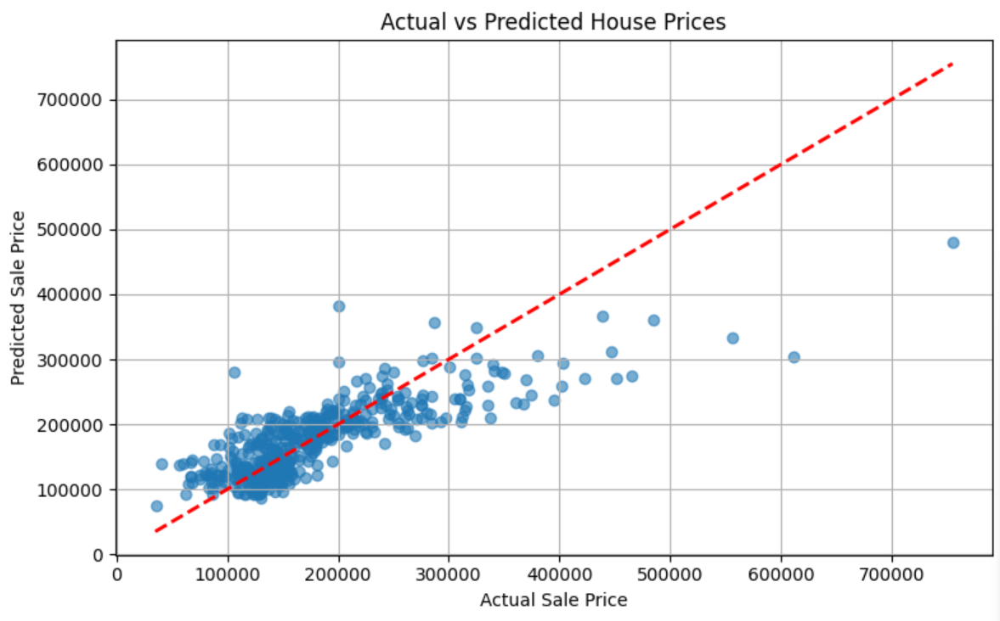

# PRODIGY_ML_01 - Linear Regression on House Prices

This project is part of the **Machine Learning Internship** offered by **Prodigy InfoTech**.

---

## 📊 Task Objective

Implement a **Linear Regression** model to predict house prices based on:

- Square footage (`GrLivArea`)
- Number of bedrooms (`BedroomAbvGr`)
- Number of bathrooms (`FullBath`)

📌 **Dataset Source**: [Kaggle - House Prices: Advanced Regression Techniques](https://www.kaggle.com/c/house-prices-advanced-regression-techniques/data)

---

## 🔧 Tools & Libraries Used

- Python 🐍  
- Pandas  
- NumPy  
- Matplotlib  
- Seaborn  
- Scikit-learn  
- Google Colab

---

## 📈 Approach

1. Loaded and explored the dataset
2. Selected key features: `GrLivArea`, `BedroomAbvGr`, and `FullBath`
3. Handled missing values (if any)
4. Split data using `train_test_split`
5. Trained a **Linear Regression** model
6. Evaluated performance using:
   - **R² Score**
   - **RMSE (Root Mean Squared Error)**
7. Visualized predictions using scatter plots and regression lines

---

## ✅ Results

- **R² Score**: `0.63`  
- **RMSE**: ` 50751.91`

📝 *Note: Results may vary slightly depending on random state and preprocessing.*

---

## 📁 Files in This Repository

- `PRODIGY_ML_01.ipynb` → Full implementation notebook  
- `README.md` → Project overview  
- `output.png` → Regression plot image

---

## 🔗 Open in Google Colab

---

## 🚀 Output Preview

---

## 📚 Learning Outcomes

- Understood the fundamentals of Linear Regression
- Practiced feature selection and data preprocessing
- Built and evaluated a machine learning model on a real-world dataset
- Gained hands-on experience with regression metrics and data visualization

---

## 📝 Final Note

✅ This repository is maintained as part of the **Prodigy InfoTech Machine Learning Internship**.  
🔍 Only the specified 3 features were used, as per the given task requirements.

